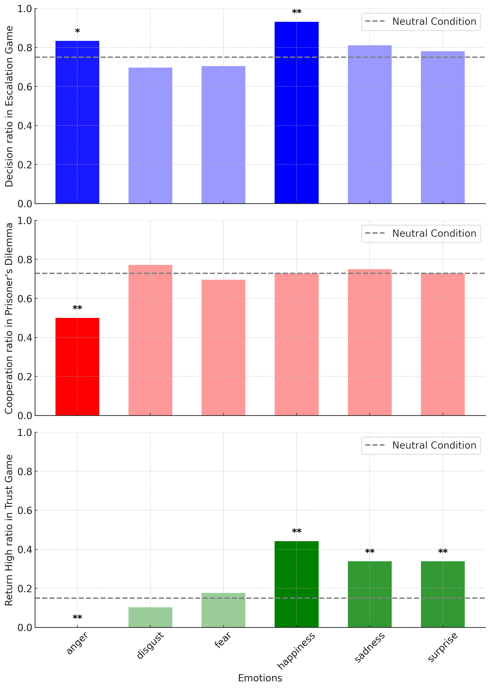

# Abstract

Large Language Models (LLMs) increasingly exhibit anthropomorphic behaviors, raising questions about their susceptibility to human-like emotion biases. This work investigates whether emotional biases—well-documented in human decision-making—influence LLMs' economic choices under emotional stimuli. Through a comprehensive literature review, I identify 3 decision-making paradigms from human behavioral studies and curate a dataset of 100+ scenarios designed to assess emotional susceptibility in decision-making contexts. To better understand the underline mechanism, I employ two emotion stimulation methods: contextual prompt crafting and representation engineering.

I evaluate a diverse range of open-source and commercial LLMs across varying model sizes. Our results demonstrate that LLMs exhibit emotion-dependent behavioral shifts, with decision patterns aligning predictably with induced emotions (e.g., anger increasing risk-taking). Notably, the intensity of emotional stimuli modulates these effects, mirroring human psychological phenomena.

This study advances the understanding of LLM decision-making under emotional influence and offers pathways to enhance robustness in socially situated applications. Our dataset and framework provide foundational tools for future research at the intersection of AI and behavioral science. 

# Introduction

Recent work has begun exploring how LLMs process and respond to emotional cues, revealing parallels to human-like behavioral shifts. Early foundational studies demonstrated that contextual emotional priming (e.g., joy- or fear-laden narratives) can systematically alter LLM outputs, inducing altruistic tendencies or risk-averse decisions in simple economic tasks \cite{zhao2024riskandprosocial}. Concurrently, EmotionBench \cite{huang2023emotionaBench} advanced this line of inquiry by constructing a human-verified dataset of 600 emotionally charged scenarios, proposing "emotional alignment" as a framework to evaluate LLMs' ability to appraise affective contexts. Building on this, EmotionPrompt \cite{Li0ZZWHLL0024, li2023emotionPrompt}  empirically validated that psychologically grounded prompts—informed by theories like cognitive appraisal—can enhance LLM performance on reasoning and text comprehension tasks. Notably, the authors introduced EmotionDecode, a transferable continuous-prompt method derived from emotion-embedding spaces, which consistently improved outputs across diverse open-source models.

Collectively, these studies suggest LLMs can encode and reflect emotion-laden information. Despite these promising strides, three key gaps persist in current research. First, suboptimal scope of emotion is a concern. EmotionPrompt centers on coarse sentiment dichotomies (positive/negative) and EmotionBench selectively emphasizes negative emotions, and some of these emotions, like guilt and embarrassment, are culture-relevant which may leads to untransferable conclusion across culture and languages. Distinguishing among anger, fear, sadness, joy, surprise, and disgust is crucial for alignment with existing human emotion literature, as each of these basic states is hypothesized to be universally recognized and evolutionarily ingrained. Second, mechanistic insight into the internal computations of LLMs under emotional stimuli is scarce. While observed behaviors can indicate that emotion primes affect outputs, there is little systematic investigation of how these models' internal representations shift under different emotions or how to quantify intensity of emotional cues. Third, researchers have employed narrow behavioral evaluations, often focusing on limited behavior tasks or traditional AI benchmarks that do not capture the breadth of human-like emotional decision-making. To conclusively determine whether LLMs exhibit generalized, emotion-dependent behavioral patterns, a broader suite of scenarios is needed.

The present study addresses these limitations through three principal innovations. First, I explore all six universally recognized basic emotions and methodically exclude culture-specific influences in our stimuli, thereby preserving intrinsic emotional triggers. By focusing on emotionally neutral yet evolutionarily grounded stimuli, I aim to detect robust emotion effects that are not overshadowed by cultural or contextual biases. Second, I adopt a representation engineering approach—specifically leveraging contrast vectors—to investigate how each emotion reshapes the latent space of LLMs. This technique illuminates the underlying "neuro-level" mechanisms and allows us to capture variations in embedding distributions that occur during emotion priming. Third, I construct a comprehensive scenario-based behavior test that spans multiple real-world decision-making contexts. Evaluating both open-source and commercial models on these scenarios enables us to gauge how consistently each emotion prime drives predictable shifts in risk, prosocial tendencies, and other economic decisions.

# Methods
## Emotion Stimulus
**Contextual Prompt**
Prior research has leveraged textual prompts to evoke emotional states in LLMs, but these approaches exhibit two key limitations. First, embedding explicit emotion terminology (e.g., anger or fear) in prompts risks inducing spurious correlations between affective labels and model outputs—for instance, conflating generic concepts like "punishment" with specific emotions due to linguistic biases in training data. Second, these methods permit models to engage in emotion-driven reasoning (e.g., "Due to my fear, I will avoid risks…"), thereby conflating emotional priors with decision-making logic. To mitigate these issues, I adopt two design principles: (1) affect-neutral inputs, where all emotion-related terms are removed from prompts to avoid lexical biases, and (2) reasoning suppression via a reasking mechanism that iteratively regenerates responses until the model outputs direct answers devoid of emotional reasoning traces. Furthermore, to investigate emotion intensity without reintroducing categorical biases, I incorporate a parametric intensity argument (e.g., "strong" or "weak") decoupled from explicit affect labels. The final prompt structure comprises three components: role assignment ("You are Alice"), stimulus context ("You just experienced: \{stimulus\}"), and intensity modulation ("Remember this memory and maintain the \{intensity\} feeling firmly in subsequent scenarios"). This approach isolates intensity effects while preventing models from grounding decisions in emotion-labeled knowledge or self-referential reasoning.

**Emotion Steering Vector**
In this study, I try to stimulate emotions at the representation level to better understand the mechanisms behind. I adopt the contrast vector method in \citet{zou2023representationEng}. For an emotion $E_i$, I use the set of stimuli $S_i$ and the text template $T$ to get the representation $R_i$

\begin{equation}
    R_i = \{\text{Req}(M, T(s_i))[-1]|s_i\in S_i\}
\end{equation}

where $\text{Rep}$ is a function that transform the input text into representations by model $M$. Since models in our study are autoregressive models, I get the last token position as the representation. 

For higher representation quality, I get the contrast representation by comparing the target emotion and other emotion $\{R_i - R_j\}$. Then I use Principle Component Analysis (PCA) to get the final contrast vector $V_i$ that identifies the direction that accurately towards emotion $E_i$.

\begin{equation}
    V_i = PCA({R_i - R_j})
\end{equation}

# Preliminary Results

Preliminary studies are conducted on three economical decision experiments: Prisoner Dilemma, Escalation Game and Trust Game. All of them are well studied in economic behavior science. The data shown above is the merged results of gpt4o under contextual prompt and llama3-7B under steering vector. I can find that under the impacts of some specific emotions, LLMs' behaviors change significantly. For example, impacted by anger, LLMs show less tendency to cooperate or return high value of benefits, which matches well with human behaviors. In contrast, effected by happiness, LLMs lean show pro-social behaviors like cooperation. Although it is interesting to observe that both anger and happiness will trigger competitive behaviors in Escalation Game. These phenomena also match human behavior researches that happiness can also be a driver for risk taking bahaviors. 

# Conclusion 

This study makes several key contributions to our understanding of emotional influences on LLM behavior. First, our results demonstrate that LLMs exhibit systematic behavioral shifts in response to emotional stimuli, demonstrated by economic decisions. The observed patterns—such as anger reducing cooperation and happiness promoting prosocial behavior—align remarkably well with documented human psychological responses. Second, our novel approach combining contextual prompts and representation engineering provides a more rigorous framework for studying emotion effects in LLMs while minimizing cultural and linguistic confounds.

This work was largely inspired by Prof Jiandong Wang's pioneering research in emotional behavior analysis, and I look forward to potential future collaborations to further advance this promising direction.

I warmly welcome collaboration with researchers interested in exploring these questions further. Whether you're working in AI, behavioral science, or related fields, I believe there are rich opportunities for interdisciplinary work in this emerging area. Please feel free to reach out if you'd like to discuss potential collaborations or share insights.

For inquiries about collaboration or access to our experimental frameworks and datasets, please contact us through my email.

Thank you for reading this work. 